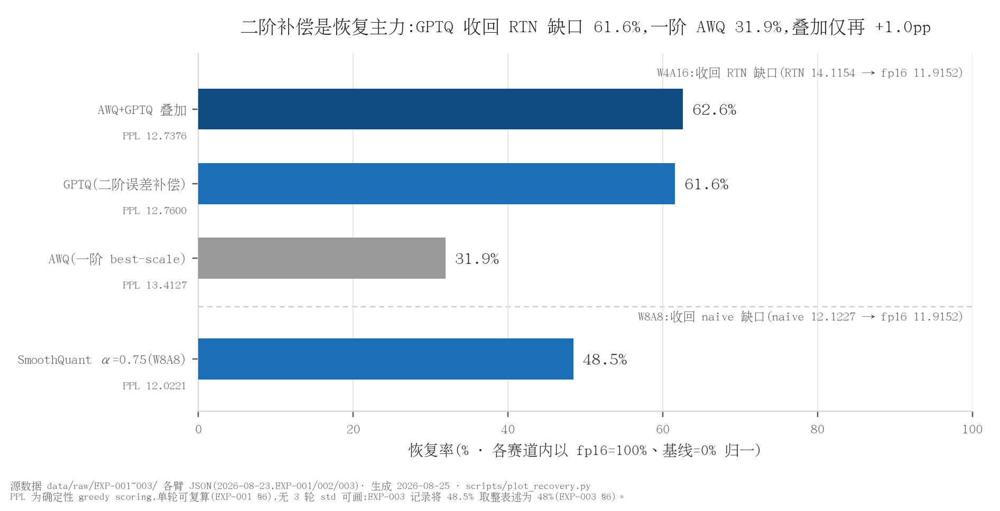
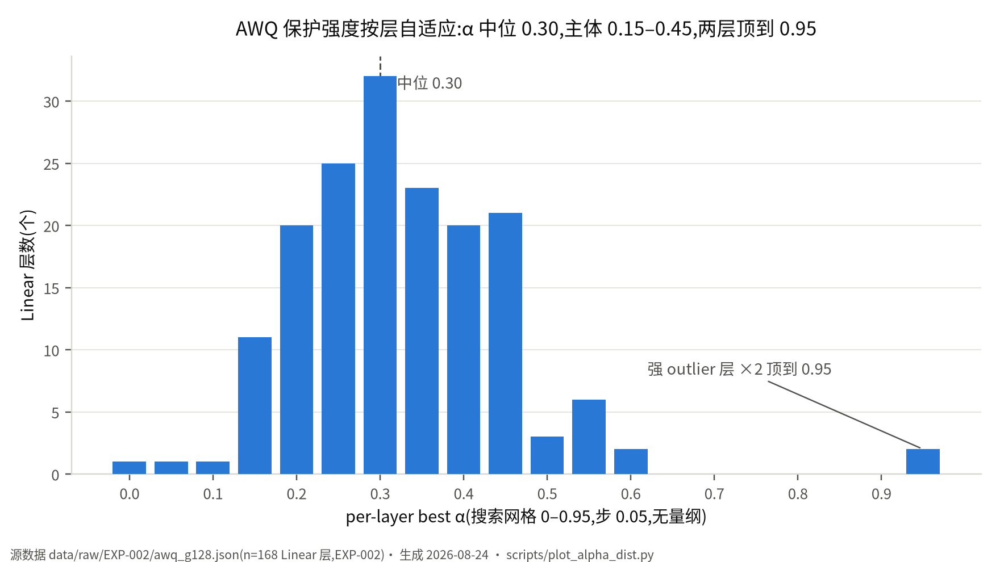

# LLM_Quantization

*GPTQ / AWQ / SmoothQuant 训练后量化从零实现,同一协议下的控制变量对照*

训练后量化的三种主流方法——GPTQ、AWQ、SmoothQuant——各自的核心机制分别贡献了多少质量?论文各用各的模型与评测口径,数字之间无法直接比较。本项目从零实现三者的算法主循环,放进同一模型、同一量化网格、同一 PPL 协议的控制变量对照里回答这个问题:W4A16 与 W8A8 双赛道,fake quant 与 real quant(INT4 打包)双链路,每个数字可从 `data/raw/` 复算。

## 主要结果

测量协议:Qwen2.5-0.5B,wikitext-2 PPL(窗 2048/步 1536,各臂同 298302 计分 token;确定性 greedy scoring,单轮可逐位复算)。PPL 为自定义协议,只作协议内臂间相对比较,不与文献绝对值对比。

| 结果 | 数字 | 出处 |
|---|---|---|
| GPTQ 从零实现:二阶误差补偿收回 RTN 质量损失 | **61.6%**(PPL 14.1154 至 12.7600,fp16 11.9152;单轮确定性评测) | [EXP-001](records/EXP-001_gptq_from_scratch.md),`data/raw/EXP-001/` |
| AWQ 从零实现(per-linear 简化、无 clip):一阶 best-scale 收回 | **31.9%**(13.4127) | [EXP-002](records/EXP-002_awq_and_stack.md),`data/raw/EXP-002/` |
| AWQ+GPTQ 叠加:正交方向成立,0.5B 上高度重叠 | **62.6%**(12.7376,vs 单独 GPTQ 仅 +1.0pp) | [EXP-002](records/EXP-002_awq_and_stack.md) |
| SmoothQuant W8A8(α=0.75)收回 naive 缺口(0.5B 激活 outlier 温和的语境下) | **48%**(12.0221 vs 12.1227) | [EXP-003](records/EXP-003_smoothquant_w8a8.md),`data/raw/EXP-003/` |
| real quant 闭环:INT4 两枚一字节打包,pack 与 fake 逐元素断言 | 168/168 层通过,最大误差 ≤7.3e-4 | [EXP-001](records/EXP-001_gptq_from_scratch.md) §5 |

<details>
<summary>完整主对照表(逐臂 PPL)</summary>

W4A16 赛道(INT4 per-group g=128 非对称,同一量化网格):

| 臂 | PPL | Δ vs fp16 | 收回 RTN 损失 | 出处 |
|---|---|---|---|---|
| fp16 基线 | 11.9152 | — | — | EXP-001 |
| RTN(对照) | 14.1154 | +2.2002 | — | EXP-001 |
| AWQ(α 网格 best-scale) | 13.4127 | +1.4975 | 31.9% | EXP-002 |
| GPTQ(二阶补偿) | **12.7600** | +0.8448 | 61.6% | EXP-001 |
| AWQ+GPTQ(叠加) | **12.7376** | +0.8224 | 62.6% | EXP-002 |

W8A8 赛道(W: per-输出行对称 INT8;A: per-token 对称 INT8):

| 臂 | PPL | Δ vs fp16 | 出处 |
|---|---|---|---|
| naive W8A8 | 12.1227 | +0.2075 | EXP-003 |
| smooth α=0.25 | 12.2332 | +0.3180(迁移不足反伤权重) | EXP-003 |
| smooth α=0.50 | 12.0394 | +0.1242 | EXP-003 |
| smooth α=0.75 | **12.0221** | +0.1069 | EXP-003 |

</details>



*图 1:GPTQ 的二阶补偿是恢复主力,收回 RTN 缺口 61.6%;AWQ 一阶启发式收回 31.9%,叠加仅再 +1.0pp。(数据:`data/raw/EXP-001/` 至 `data/raw/EXP-003/` 各臂 JSON;脚本:`scripts/plot_recovery.py`;EXP-003 记录取整表述为 48%)*



*图 2:AWQ 保护强度按层自适应,per-layer best-α 中位 0.30,主体 0.15-0.45,两强 outlier 层顶到 0.95。(数据:`data/raw/EXP-002/awq_g128.json`;脚本:`scripts/plot_alpha_dist.py`)*

## 关键发现

**二阶补偿收回的损失几乎是一阶方法的两倍。** RTN 的优化目标是权重误差 ‖W-Q‖²,而推理在乎的是输出误差。AWQ 用激活幅值做一阶重要性加权(per-channel scale),把「哪些权重重要」的信息注入量化网格,收回 31.9%;GPTQ 则用校准集 Hessian(XXᵀ)的逆逐列补偿:每量化一列,把该列的量化误差按 [H⁻¹] 摊到尚未量化的列上,直接最小化输出误差的二阶近似,收回 61.6%。两条路线的差距,即「二阶信息」在这个问题上的定价。

**叠加方向正交,但小模型上高度重叠。** AWQ 先把 outlier 通道缩回易量化区间,GPTQ 再补偿残余误差,机制上互不冲突,叠加后收回 62.6%——但相对单独 GPTQ 只再 +1.0pp。0.5B 上两者保护的其实是同一批「难量化权重」:AWQ 能救的,GPTQ 大多也能救。这解释了工程实践中两者通常二选一而非默认叠加。

**SmoothQuant 的收益随模型规模增长,0.5B 上的小缺口恰是反向证据。** naive W8A8 在 0.5B 上只掉 +0.21 PPL:小模型激活 outlier 温和,本就没有多少困难可解。迁移强度 α 的扫描单调向好:α=0.75 收回缺口 48%,α=0.5 次之,而 α=0.25 比 naive 还差——迁移不足时权重端先被撑大的 scale 所伤,激活端却没换来足够收益。这个主动保留的反例臂说明 α 是真实的权衡旋钮,不是「加了就好」。

**保护强度是按层搜出来的,不是全局常数。** AWQ per-layer best-α 中位 0.30、主体 0.15-0.45,但两个强 outlier 层顶到搜索网格上限 0.95(见图 2)——校准搜索自动识别出激活分布极端的少数层并给足保护,这正是「用一阶激活统计换网格友好度」这一机制在真实网络里的形状。

## 代码结构

```
src/            gptq.py(二阶补偿) awq.py(best-scale 搜索) smoothquant.py(迁移+W8A8)
                quant_linear.py(INT4 打包与 pack/fake 断言)
scripts/        run_w4a16.py / run_w8a8.py / run_all*.sh / plot_*.py
records/        EXP-001~003 实验记录
data/raw/       EXP-00{1,2,3}/ 原始结果(自带来源字段)
docs/theory/    01_gptq / 02_awq / 03_smoothquant
docs/talk/      讲解提纲
figures/        全部由脚本从 raw 重算生成
llmqt_example/  早期 AutoAWQ 侧实践(连完整 git 历史并入的只读快照)
```

GPTQ 的核心在两处:Cholesky 求 H⁻¹ 的上三角因子,以及逐列量化加两级误差补偿(块内立即、块间延迟)。节选自 [src/gptq.py](src/gptq.py) `GPTQ.quantize()`(`# <-` 注释为导览所加):

```python
# Hinv 的上三角 Cholesky 因子:对角元即 [H^-1]_jj^(1/2) 的行主元
Hinv = torch.linalg.cholesky(H)
Hinv = torch.cholesky_inverse(Hinv)
Hinv = torch.linalg.cholesky(Hinv, upper=True)
...
for i in range(i2 - i1):                     # <- 块内逐列量化
    w = W1[:, i]
    dq, q = self.quantizer.quantize(w, scales[:, g], zeros[:, g])
    Q1[:, i] = dq
    if use_hessian:                          # <- False 即退化为 RTN 对照臂
        err = (w - dq) / Hinv1[i, i]         # <- 量化误差按 [H^-1] 对角归一
        W1[:, i:] -= err.unsqueeze(1) * Hinv1[i, i:].unsqueeze(0)
        Err1[:, i] = err                     # <- 立即补偿到块内未量化列
...
Q[:, i1:i2] = Q1
if use_hessian and i2 < self.columns:
    W[:, i2:] -= Err1 @ Hinv[i1:i2, i2:]     # <- 块间 lazy update:批量补偿后续列
```

`use_hessian` 开关即 EXP-001 的实验设计本身:RTN 臂与 GPTQ 臂共用同一 `GroupQuantizer` 与量化网格,唯一差异为补偿开关,61.6% 的恢复量因此可完全归因于二阶补偿机制。INT4 打包与 pack/fake 断言见 [src/quant_linear.py](src/quant_linear.py);AWQ 的 α 网格搜索见 [src/awq.py](src/awq.py),SmoothQuant 迁移见 [src/smoothquant.py](src/smoothquant.py)。

原理笔记(五节体:结论/机制/本仓实证/面试 Q&A/延伸):[01_gptq](docs/theory/01_gptq.md),[02_awq](docs/theory/02_awq.md),[03_smoothquant](docs/theory/03_smoothquant.md)。学习方法论见 [docs/HOW_TO_LEARN_A_QUANT_METHOD.md](docs/HOW_TO_LEARN_A_QUANT_METHOD.md),讲解提纲见 [docs/talk/quant_walkthrough.md](docs/talk/quant_walkthrough.md)。

## 快速开始

```bash
V=/root/venvs/v0.25.1/bin/python
$V scripts/run_w4a16.py --mode {fp16|rtn|gptq|awq|awq_gptq} --group-size 128 --out <json>
$V scripts/run_w8a8.py  --mode {fp16|naive|smooth} [--alpha 0.5] --out <json>
# 批量: scripts/run_all.sh(EXP-001 三臂) / scripts/run_all2.sh(EXP-002/003)
# 图(全部从 raw 重算生成):
/root/venvs/kernel-opt/bin/python scripts/plot_recovery.py
/root/venvs/kernel-opt/bin/python scripts/plot_alpha_dist.py
```

环境与异地复现见 [ENV.md](ENV.md)(单卡 ≥8GB 显存即可)。

## 实验记录

| 记录 | 结论 |
|---|---|
| [EXP-001:GPTQ 从零实现](records/EXP-001_gptq_from_scratch.md) | 二阶误差补偿收回 RTN 质量损失 61.6%;INT4 打包 168/168 层逐元素断言通过 |
| [EXP-002:AWQ 与叠加](records/EXP-002_awq_and_stack.md) | 一阶 best-scale 收回 31.9%;AWQ+GPTQ 叠加 62.6%,方向正交但 0.5B 上高度重叠 |
| [EXP-003:SmoothQuant W8A8](records/EXP-003_smoothquant_w8a8.md) | α=0.75 收回 naive W8A8 缺口 48%;α=0.25 反例更差,收益随模型规模增长 |

## 测量方法

- **每个数字可溯源**:进正文的每个数字都能指回 `data/raw/` 的原始结果文件,文件自带完整来源字段(环境/代码版本/命令/硬件);图表一律由脚本从原始数据重算生成,不手改。
- **误差条**:关键结论要求 ≥3 轮取 mean±std;本仓 PPL 为确定性 greedy scoring(无采样、seed 固定),单轮即可逐位复算,故各数字注明「单轮」。
- **对照与反例臂**:每个主张配「唯一差异=机制开关」的控制变量对照(RTN 之于 GPTQ,naive 之于 SmoothQuant),并主动保留反例臂(α=0.25 迁移不足反伤权重)。
- **负结果照常报告**:未达预期的结果与结论同等呈现(叠加仅 +1.0pp、α=0.25 更差);量纲未标定的诊断值不进任何表格(EXP-001 §7)。

## 相关项目

- [vllmExperience](https://github.com/lyell0710/vllmExperience):vLLM serving 侧证据仓;本仓 GPTQ 离线算法与其 EXP-016(GPTQ-Int4+Marlin 在线部署)构成「离线算法到在线部署」完整链(EXP-001 §8)。
- [Kernel_Optimazation](https://github.com/lyell0710/Kernel_Optimazation):CUDA kernel 优化证据仓;本仓的控制变量/反例臂方法论与其同源。
- [llm-engine](https://github.com/lyell0710/llm-engine):推理引擎实践仓。
- LLMQT_Example:早期 AutoAWQ 侧量化实践,已连完整 git 历史并入本仓 `llmqt_example/`。
